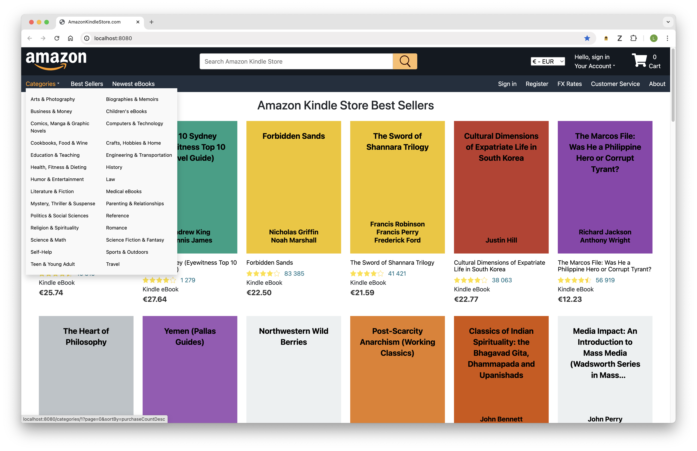
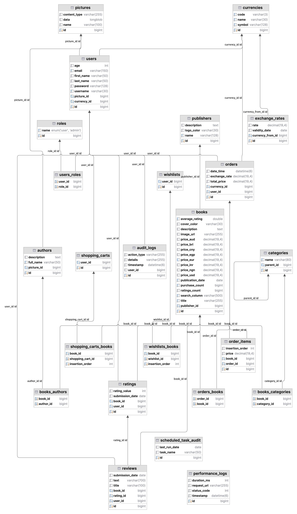
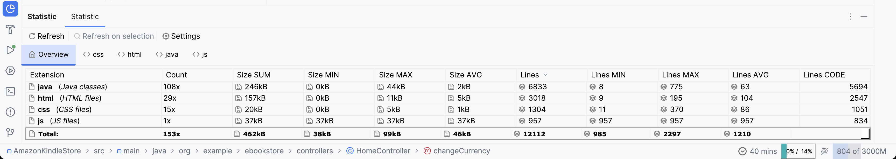
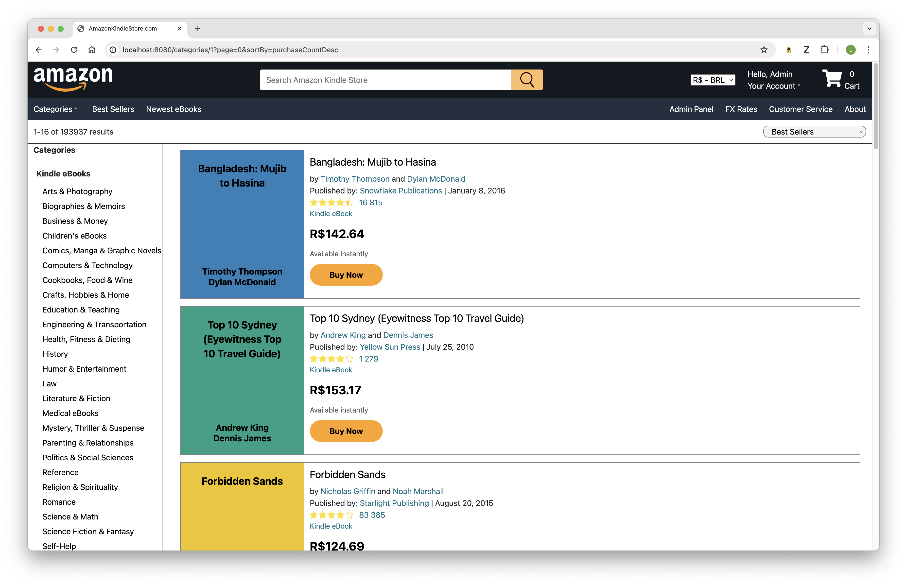
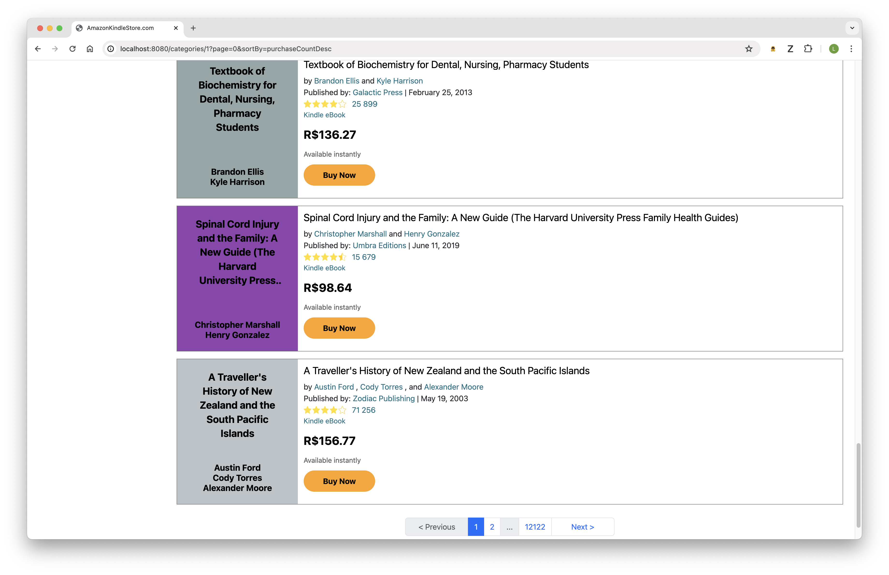
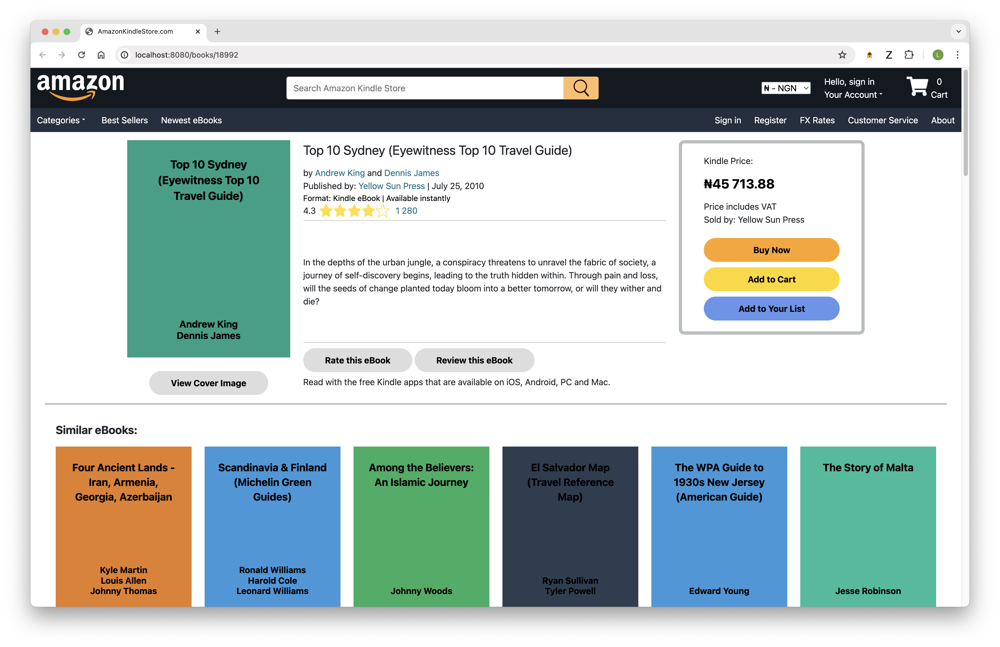
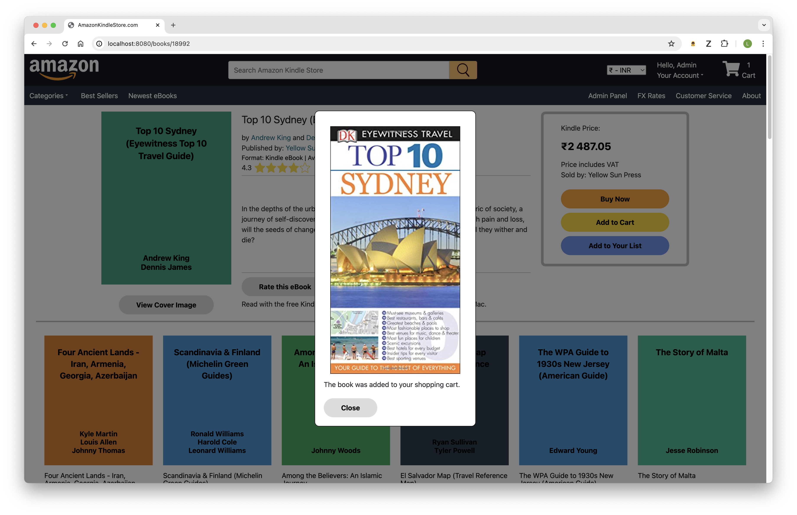
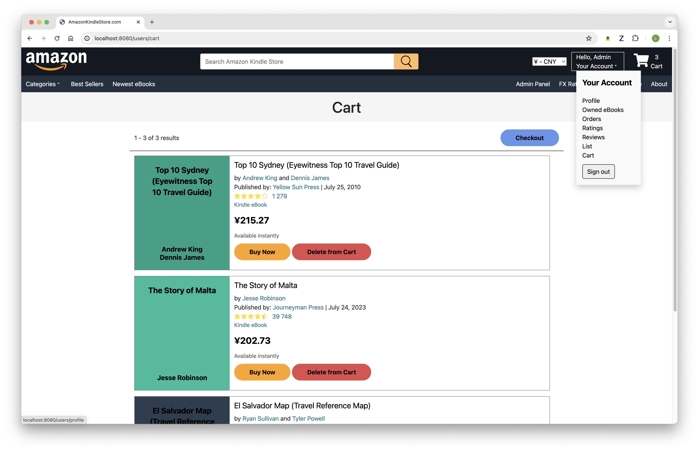
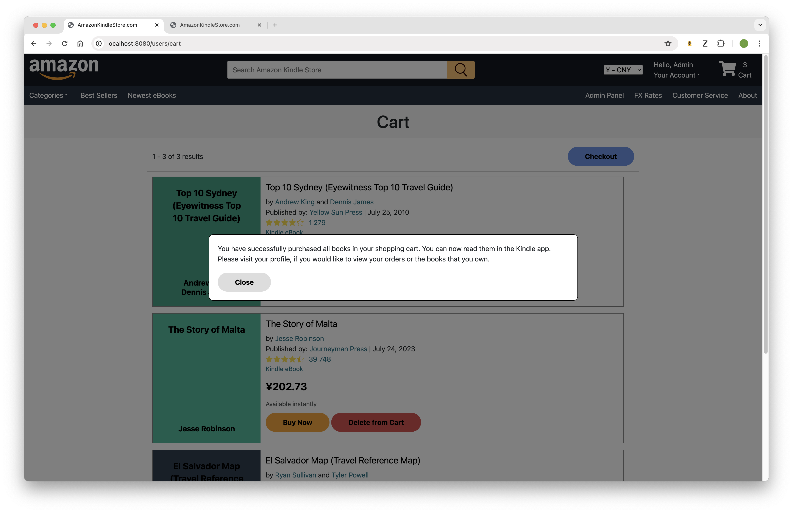
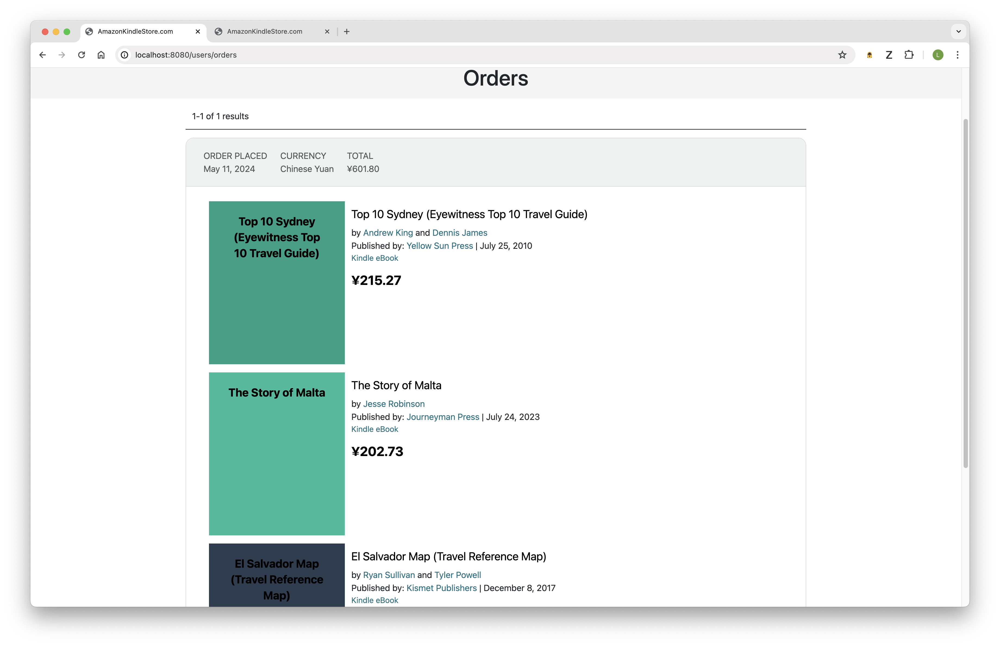

<h1 align="center" id="amazon-kindle-store"></h1>



## Overview

**Built with**
<div style="display: flex; align-items: flex-start;">
   
   
   
   
   
   <br>
   
   
   
   
   
   
</div>

This is a clone of the [Amazon Kindle Store](https://www.amazon.com/Kindle-Store/b?ie=UTF8&node=133140011).
The store supports a hierarchy of eBook categories (N-ary tree), multiple currencies, pagination, filtering, sorting, users, roles,
authors, publishers, wishlists, shopping carts and orders. Customers can add, delete, and update ratings and reviews and
also search for books by title, author(s) name(s) and publisher name. Project Statistics: 193000 eBooks, 5909
categories, 13200 authors, 152 publishers, and 8 currencies.

The web application is designed to be responsive, ensuring an optimal viewing experience across various devices including monitors, laptops, tablets, and phones.
Some of the other application features are:
- Daily scheduled tasks to get the latest exchange rates via an API, update book prices in foreign currency, and back up the database
- Use of AJAX requests, modals, and DOM manipulation in order to improve the user experience by enabling the following functionalities without a full-page reload:
  - Purchasing books
  - Adding books to the user's list or shopping cart and updating the number of books in the cart
  - Submitting ratings and reviews
  - Dynamically updating the book's average rating and count of ratings upon submission
  - Deleting the last review and displaying the new review on top
  - Deleting books from the user’s list or cart, deleting ratings or reviews and showing the items as deleted
- Cookie for saving the selected currency of users who are not logged in
- Performance logs, login successes and failures logs
- One-day caching for: the currencies in the currency dropdown, the categories in the categories dropdown, the homepage books, and the homepage BookDtos for each currency
- Use of recursive common table expressions in order to find all parent categories and all subcategories of a given category

### Screenshots



**The statistics below do not include tests**


<p align="center">
   
   
   
   
</p>

## Video Presentation

You can find below parts one and two of a video presentation of my clone project uploaded on YouTube.
<p align="center">
  <a href="https://youtu.be/IuM2iNIxQKQ">
    
  </a>
  <a href="https://youtu.be/onnj3m1jVr0">
    
  </a>
</p>

## Installation

1. Clone or download this repository
2. Configure the following environment variables related to the database that you would like to use and the exchange
   rate API key:

```properties
# Database Properties
spring.datasource.driverClassName=com.mysql.cj.jdbc.Driver
spring.datasource.url=jdbc:mysql://localhost:3306/ebook_store?useSSL=false&createDatabaseIfNotExist=true&allowPublicKeyRetrieval=true
spring.datasource.username=${DB_USERNAME}
spring.datasource.password=${DB_PASSWORD}

# Database Backup Properties
backup.database.name=ebook_store
backup.database.user=${DB_USERNAME}
backup.database.password=${DB_PASSWORD}
backup.file.path=src/database_backups
backup.dump.path=/usr/local/mysql/bin/mysqldump

# Free API key for getting the latest exchange rates with 1500 monthly requests
# You can use this key or get your own key by registering at https://www.exchangerate-api.com/
exchangerate.api.key=a9efd8f3e3c147edd16e527e
```

3. Run the application

Whenever the application is run, the InitialDatabaseSetup component checks whether the "publishers" table is empty and, if it is, generates the database. The TaskStartupRunner component checks if
the database has been backed up and if the foreign exchange rates have been updated today. If not, it backs up the
database, updates the exchange rates, and then updates the book prices in foreign currency. The database generation,
backup, and updating the exchange rates and book prices takes about 6 minutes on my laptop.

> [!NOTE]
> The original book data used in this project is sourced from
> the [Kyushu University / book-dataset](https://github.com/uchidalab/book-dataset/tree/master/Task2) public repository.
> The CSV file included in my repository has been modified for use in this specific application. I have used the book
> titles, cover image urls, and categories from the original dataset. These categories have been filtered and mapped
> to the categories that can be seen on the official Kindle Store. The InitialDatabaseSetup has generated the rest 
> of the data - author names, publisher names, count of ratings, average rating, count of purchases, publication 
> dates, subcategory names, placeholder reviews, etc.

## Usage

You need to enter an email and a password in order to log in to the application. The InitialDatabaseSetup component
generates the following two accounts

| Email          | Password |
|----------------|----------|
| admin@mail.com | 1234     |
| user@mail.com  | 1234     |

admin@mail.com has the roles "ADMIN, USER", and user@mail.com has the role "USER". Only accounts with the ADMIN role can
access the admin panel, which allows them to add and remove the ADMIN role from other accounts.
